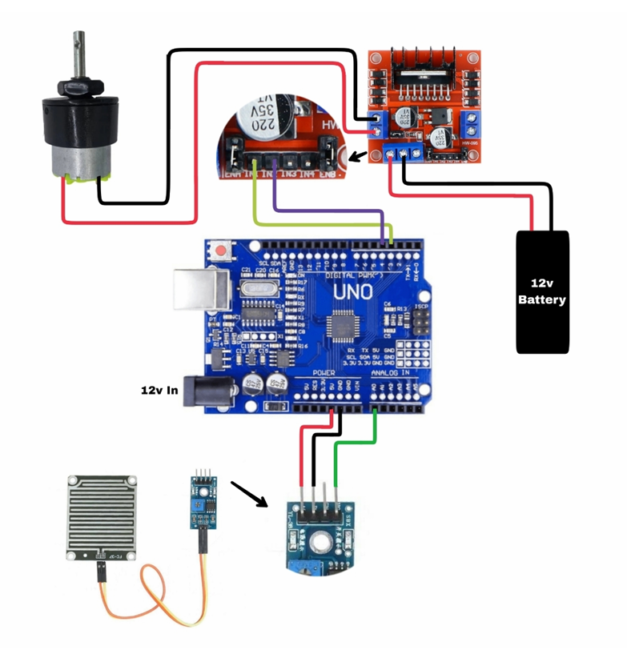

# 🌦️ Automated Smart Cloth Drying Rack System

[](https://www.arduino.cc/)
[](LICENSE)

An intelligent cloth drying system that automates the process of exposing clothes to sunlight and retracting them under shelter based on real‑time environmental conditions. The system uses an **RTC module** to track cumulative drying time, an **LDR** to detect sunlight intensity, and a **Rain Sensor** to protect laundry from unexpected rain.

---

## 📑 Table of Contents

1. [Overview](#-overview)
2. [Features](#-features)
3. [Hardware Requirements](#-hardware-requirements)
4. [Circuit Diagram](#-circuit-diagram)
   - [Pin Connections](#pin-connections)
5. [Working Principle](#-working-principle)
   - [Cumulative Drying Logic](#cumulative-drying-logic-using-rtc)
   - [State Machine](#state-machine)
6. [Code Explanation](#-code-explanation)
   - [Key Functions](#key-functions)
   - [Main Loop Logic](#main-loop-decision-making)
7. [Installation & Usage](#-installation--usage)
8. [Project Gallery](#-project-gallery)
9. [Future Enhancements](#-future-enhancements)
10. [License](#-license)

---

## 📖 Overview

This project automates a clothesline or drying rack using a stepper motor. The system continuously monitors:

- **Sunlight Intensity** via an LDR (Light Dependent Resistor)
- **Rainfall** via a rain sensor module
- **Cumulative Drying Time** via a DS3231 Real‑Time Clock (RTC)

When conditions are favourable (bright sunlight, no rain), the rack moves **out** to the sun. The RTC starts counting the *actual* exposure time. If it rains or sunlight drops, the rack retracts **immediately** and the timer **pauses**. Once the total accumulated sun time reaches a pre‑set threshold, the rack returns to the shelter – clothes are dry.

---

## ✨ Features

- **Rain Protection:** Instant retraction when water is detected.
- **Light Optimisation:** Only deploys when sunlight is sufficient.
- **Cumulative Timer:** Pauses and resumes drying time across multiple sessions (e.g., brief rain showers do not reset the cycle).
- **Autonomous Operation:** No user intervention required after setup.
- **Serial Monitor Feedback:** Real‑time sensor readings and system status.

---

## 🔧 Hardware Requirements

| Component                  | Quantity | Notes                                 |
|----------------------------|----------|---------------------------------------|
| Arduino Uno / Nano         | 1        |                                       |
| DS3231 RTC Module          | 1        | I2C interface (SDA, SCL)              |
| 28BYJ‑48 Stepper Motor     | 1        | with ULN2003 driver board             |
| Rain Sensor Module         | 1        | Analog output                         |
| LDR Sensor Module          | 1        | Analog output (or voltage divider)    |
| 5V Power Supply            | 1        | Adequate for motor & Arduino          |
| Jumper Wires               | –        | Male‑to‑female / male‑to‑male         |

---

## 📐 Circuit Diagram

*Place your circuit diagram image inside the `images/` folder at the root of the repository.*



### Pin Connections

| Module             | Module Pin | Arduino Pin | Code Reference                  |
|--------------------|------------|-------------|---------------------------------|
| **DS3231 RTC**     | SDA        | A4 (SDA)    | `Wire.h` (default I2C)          |
|                    | SCL        | A5 (SCL)    | `Wire.h` (default I2C)          |
|                    | VCC        | 5V          |                                 |
|                    | GND        | GND         |                                 |
| **Stepper Driver** | IN1        | **8**       | `Stepper(..., 8, 10, 9, 11)`    |
|                    | IN2        | **10**      | `Stepper(..., 8, 10, 9, 11)`    |
|                    | IN3        | **9**       | `Stepper(..., 8, 10, 9, 11)`    |
|                    | IN4        | **11**      | `Stepper(..., 8, 10, 9, 11)`    |
|                    | VCC (+)    | 5V          |                                 |
|                    | GND (-)    | GND         |                                 |
| **Rain Sensor**    | A0 (Analog)| **A0**      | `analogRead(A0)`                |
|                    | VCC        | 5V          |                                 |
|                    | GND        | GND         |                                 |
| **LDR Sensor**     | A0 (Analog)| **A2**      | `analogRead(A2)`                |
|                    | VCC        | 5V          |                                 |
|                    | GND        | GND         |                                 |

> **Note:** The LDR module reading is compared against `LDRthreshold = 35`.  
> The Rain Sensor reading is compared against `rainSensorthreshold = 900`.  
> Both are **active‑low** – if the value drops *below* the threshold, the condition is considered “bad”.

---

## ⚙️ Working Principle

### Cumulative Drying Logic (using RTC)

The system does **not** rely on a simple countdown timer. Instead, it calculates the **total time the clothes have been in direct sunlight**.

- **`staingAtSun`**: Global variable storing the total accumulated sun exposure (in seconds).
- **`startTimeEpoch`**: Unix timestamp when the current sun session began.

**Example Scenario:**
1. Clothes go out at 12:00 → `startTimeEpoch` = 12:00.
2. After 2 minutes of sun, rain begins → rack retracts.
   - `stopTheClock()` computes elapsed time (120 seconds) and adds it to `staingAtSun`.
   - `startTimeEpoch` is cleared.
3. Rain stops, sun returns at 12:10 → `startTimeEpoch` = 12:10.
4. After another 2 minutes of sun → total = 120 + 120 = 240 seconds.
5. Drying target (`timeNeedToDry = 240`) reached → rack returns to shelter.

### State Machine

| Variable `isSunDrying` | RTC Timer Status | Motor Position |
|------------------------|------------------|----------------|
| `1`                    | Running          | Outside (Sun)  |
| `0`                    | Paused           | Inside (Shelter) |

---

## 💻 Code Explanation

The complete source code is available in the repository file (e.g., `smart_dryer.ino`). Below is an explanation of the key sections.

### Key Functions

| Function               | Purpose                                                                               |
|------------------------|---------------------------------------------------------------------------------------|
| `startTheClock()`      | Records current Unix time as `startTimeEpoch` to begin a new sun session.             |
| `stopTheClock()`       | Calculates time spent in current session, adds it to `staingAtSun`, then resets `startTimeEpoch`. |
| `updateStaingAtSun()`  | Internal helper used by `stopTheClock()` to update the cumulative counter.             |
| `isDried()`            | Returns `true` if `staingAtSun` + current session time >= `timeNeedToDry`.             |
| `rotateClockwise()`    | Rotates motor 6 full turns clockwise → moves rack **OUT** to sun.                      |
| `rotateAnticlockwise()`| Rotates motor 6 full turns anti‑clockwise → moves rack **IN** to shelter.              |
| `readLDR()`            | Reads analog value from pin A2.                                                        |
| `readRainSensor()`     | Reads analog value from pin A0.                                                        |

### Main Loop Decision Making

```cpp
if(ldrReading <= LDRthreshold || rainSensorReading <= rainSensorthreshold || isDried())  {
    // Go to SHELTER (Anti‑Clockwise)
}
else {
    // Go to SUN (Clockwise)
}

```

# Automated Cloth Drying System

An intelligent Arduino-based system designed to protect laundry from rain and low-light conditions while ensuring clothes are perfectly dried.

## 🛡️ Logic & Conditions
The system automatically forces the rack into the **shelter** under the following conditions:
* **Low light:** `ldrReading <= 35`
* **Rain detected:** `rainSensorReading <= 900`
* **Drying complete:** `isDried()` returns `true`

---

## 🚀 Installation & Usage

1.  **Clone the repository:**
    ```bash
    git clone [https://github.com/your-username/automated-cloth-drying-system.git](https://github.com/your-username/automated-cloth-drying-system.git)
    ```

2.  **Open the Project:**
    Open the `.ino` file in the **Arduino IDE**.

3.  **Install Required Libraries:**
    Ensure the following libraries are installed via the Library Manager:
    * `RTClib` by Adafruit (for DS3231)
    * `Stepper` (Built-in)
    * `Wire` (Built-in)

4.  **Configuration:**
    Adjust thresholds in the code if needed to suit your environment:
    * `timeNeedToDry`: Drying duration in seconds (default `240` for testing).
    * `LDRthreshold`: Light intensity threshold (default `35`).
    * `rainSensorthreshold`: Rain detection threshold (default `900`).

5.  **Deployment:**
    * Upload the code to your Arduino board.
    * Power the system with a suitable **5V supply** (ensure the motor and Arduino receive adequate current).
    * Monitor the **Serial Output (9600 baud)** to observe real-time sensor readings and system states.

---

## 📸 Project Gallery

## *(Add a short video demo or photos here. For example:)*

## 📸 Project Gallery

<p align="center">
  <a href="https://www.youtube.com/watch?v=QCpbB822hrE">
    
  </a>
  <br>
  <em>Click to watch the full system testing on YouTube</em>
</p>


**Assembled Prototype:**


---

## 🔮 Future Enhancements

* **EEPROM Storage:** Save `staingAtSun` status to EEPROM so drying progress survives a power outage.
* **Limit Switches:** Add physical end-stop switches for auto-homing and to prevent motor stalling.
* **Manual Override:** A physical button to allow users to toggle between sun/shelter manually.
* **LCD Display:** A screen to show remaining drying time and current system status.
* **IoT Integration:** Use Wi-Fi (ESP8266/ESP32) or Blynk for remote monitoring and mobile notifications.

---

## 📄 License

This project is open-source and available under the **MIT License**. Feel free to use, modify, and distribute as you wish.

Built with ☀️ and ☔ awareness.